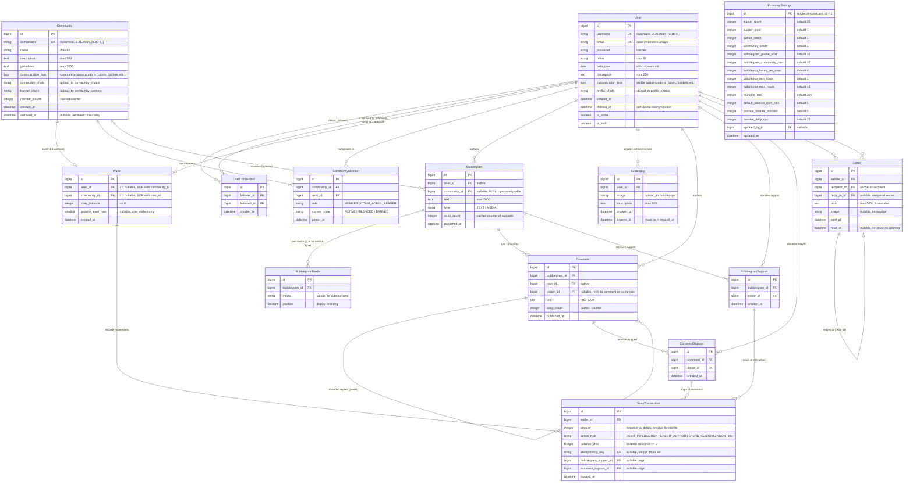

# Bubbles — Entity-Relationship Diagram

This diagram represents the complete data model for the Bubbles platform migrated in Step 1.2.

```mermaid
erDiagram
    User ||--o{ UserConnection : "follows (follower)"
    User ||--o{ UserConnection : "is followed by (followed)"
    User ||--o| Wallet : "owns (1:1 optional)"
    Community ||--o| Wallet : "owns (1:1 optional)"
    Community ||--|{ CommunityMember : "has members"
    User ||--o{ CommunityMember : "participates in"
    Wallet ||--o{ SoapTransaction : "records movements"

    User ||--o{ Bubblegram : "authors"
    Community ||--o{ Bubblegram : "contains (optional)"
    Bubblegram ||--o{ BubblegramMedia : "has media (1..N for MEDIA type)"

    User ||--o{ Bubblepop : "creates ephemeral post"

    Bubblegram ||--o{ Comment : "has comments"
    User ||--o{ Comment : "authors"
    Comment ||--o{ Comment : "threaded replies (parent)"

    Bubblegram ||--o{ BubblegramSupport : "receives support"
    User ||--o{ BubblegramSupport : "donates support"
    Comment ||--o{ CommentSupport : "receives support"
    User ||--o{ CommentSupport : "donates support"

    BubblegramSupport ||--o{ SoapTransaction : "origin of interaction"
    CommentSupport ||--o{ SoapTransaction : "origin of interaction"

    User ||--o{ Letter : "sends"
    User ||--o{ Letter : "receives"
    Letter ||--o| Letter : "replies to (reply_to)"

    User {
        bigint id PK
        string username UK "lowercase, 3-30 chars, [a-z0-9_]"
        string email UK "case-insensitive unique"
        string password "hashed"
        string name "max 50"
        date birth_date "min 14 years old"
        text description "max 250"
        json customization_json "profile customizations (colors, borders, etc.)"
        string profile_photo "upload_to profile_photos"
        datetime created_at
        datetime deleted_at "soft-delete anonymization"
        boolean is_active
        boolean is_staff
    }

    UserConnection {
        bigint id PK
        bigint follower_id FK
        bigint followed_id FK
        datetime created_at
    }

    Community {
        bigint id PK
        string commname UK "lowercase, 3-21 chars, [a-z0-9_]"
        string name "max 60"
        text description "max 500"
        text guidelines "max 2000"
        json customization_json "community customizations (colors, borders, etc.)"
        string community_photo "upload_to community_photos"
        string banner_photo "upload_to community_banners"
        integer member_count "cached counter"
        datetime created_at
        datetime archived_at "nullable, archived = read-only"
    }

    CommunityMember {
        bigint id PK
        bigint community_id FK
        bigint user_id FK
        string role "MEMBER | COMM_ADMIN | LEADER"
        string current_state "ACTIVE | SILENCED | BANNED"
        datetime joined_at
    }

    Wallet {
        bigint id PK
        bigint user_id FK "1:1 nullable, XOR with community_id"
        bigint community_id FK "1:1 nullable, XOR with user_id"
        integer soap_balance ">= 0"
        smallint passive_earn_rate "nullable, user wallets only"
        datetime created_at
    }

    SoapTransaction {
        bigint id PK
        bigint wallet_id FK
        integer amount "negative for debits, positive for credits"
        string action_type "DEBIT_INTERACTION | CREDIT_AUTHOR | SPEND_CUSTOMIZATION | etc."
        integer balance_after "balance snapshot >= 0"
        string idempotency_key UK "nullable, unique when set"
        bigint bubblegram_support_id FK "nullable origin"
        bigint comment_support_id FK "nullable origin"
        datetime created_at
    }

    EconomySettings {
        bigint id PK "singleton constraint: id = 1"
        integer signup_grant "default 20"
        integer support_cost "default 1"
        integer author_credit "default 1"
        integer community_credit "default 1"
        integer bubblegram_profile_cost "default 10"
        integer bubblegram_community_cost "default 10"
        integer bubblepop_hours_per_soap "default 4"
        integer bubblepop_min_hours "default 1"
        integer bubblepop_max_hours "default 48"
        integer founding_cost "default 300"
        integer default_passive_earn_rate "default 5"
        integer passive_interval_minutes "default 5"
        integer passive_daily_cap "default 15"
        bigint updated_by_id FK "nullable"
        datetime updated_at
    }

    Bubblegram {
        bigint id PK
        bigint user_id FK "author"
        bigint community_id FK "nullable: NULL = personal profile"
        text text "max 2000"
        string type "TEXT | MEDIA"
        integer soap_count "cached counter of supports"
        datetime published_at
    }

    BubblegramMedia {
        bigint id PK
        bigint bubblegram_id FK
        string media "upload_to bubblegrams"
        smallint position "display ordering"
    }

    Bubblepop {
        bigint id PK
        bigint user_id FK
        string image "upload_to bubblepops"
        text description "max 500"
        datetime created_at
        datetime expires_at "must be > created_at"
    }

    Comment {
        bigint id PK
        bigint bubblegram_id FK
        bigint user_id FK "author"
        bigint parent_id FK "nullable, reply to comment on same post"
        text text "max 1000"
        integer soap_count "cached counter"
        datetime published_at
    }

    BubblegramSupport {
        bigint id PK
        bigint bubblegram_id FK
        bigint donor_id FK
        datetime created_at
    }

    CommentSupport {
        bigint id PK
        bigint comment_id FK
        bigint donor_id FK
        datetime created_at
    }

    Letter {
        bigint id PK
        bigint sender_id FK
        bigint recipient_id FK "sender != recipient"
        bigint reply_to_id FK "nullable, unique when set"
        text text "max 5000, immutable"
        string image "nullable, immutable"
        datetime sent_at
        datetime read_at "nullable, set once on opening"
    }
```
